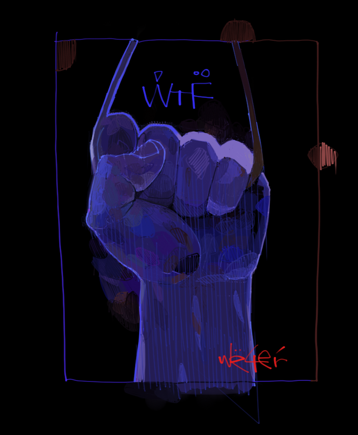
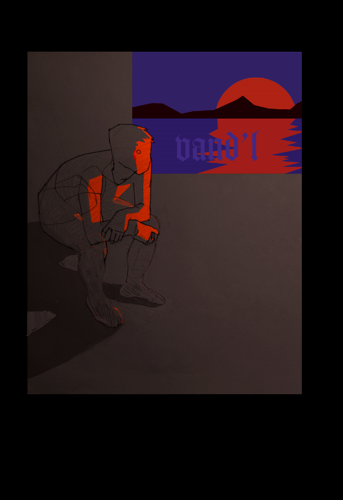
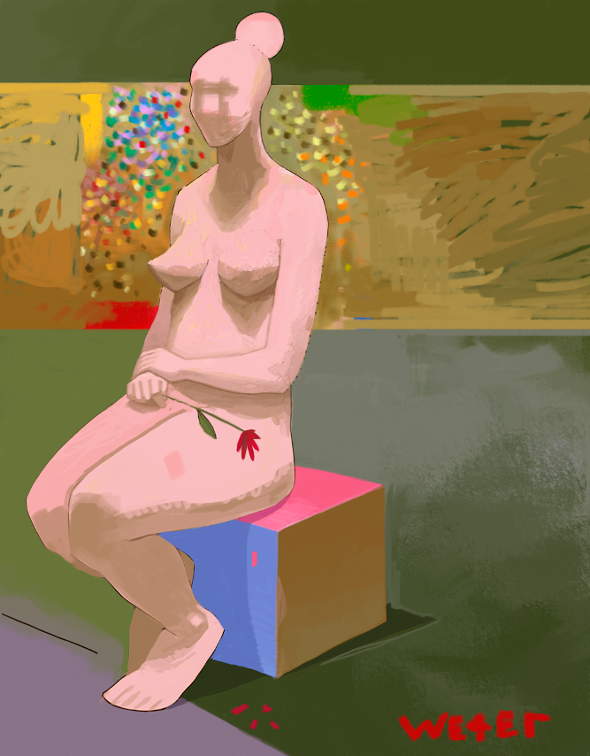
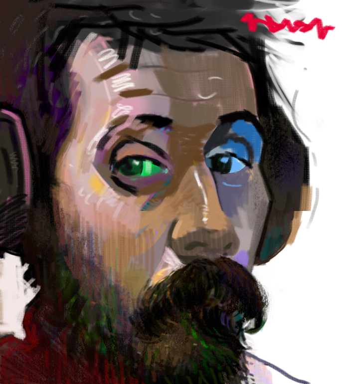

Yea, Rubik's Cube
[[clck]](https://ioinformatics.org/files/ioi1992round2.pdf)
, this is the last problem from '92:), I've made some notes
in pix/Study.ora, basically the main thing is that we 
represent a cube as 3x3 identity matrix and than ve 
find ze corresponding rotation operators, The Rubik's cube
is than 3x3x3 such cubes:). The important thing here is that
we don't rotate its faces in the usual way, instead all cubes
are standing on their places and ve rotate same face cubes
simultaneously.

[[Linger]](https://youtu.be/G6Kspj3OO0s)
